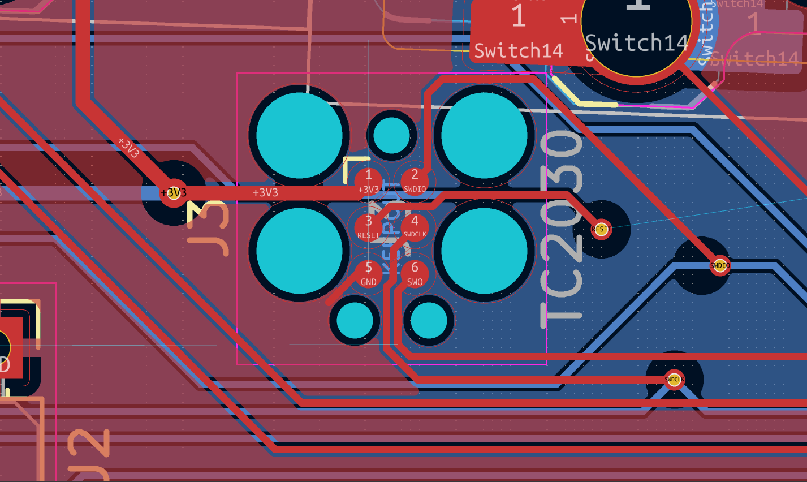

# June 26th

I started working on getting the project setup. I removed the old files, updated the Ergogen code, and recreated the KiCAD project

Also, I use Ergogen to just [place the switches](https://github.com/adamws/kicad-kbplacer) on the PCB using a KiCAD. No actual PCB is generated by it.

## Schematic work

I'm mostly taking ideas and design from the amazing [ZMK Design guide](https://github.com/ebastler/zmk-designguide) and the work I've done for quiz-sys. I plan to re-use most of the components I did for the [Woagboard v0.2](https://github.com/suyashsurya/woagboard/tree/v0.2), but with everything completely re-done.

Fun thing for the BQ24075 is that I can just... Completely ignore the SYSOFF pin. ZMK has a soft-off mode that allows me to turn off and on the keyboard
through a button, so I'll be adding that to my design.

I decided to move a bunch of components in-line rather than putting them on a separate bit of the schematic, such as the low-power oscillator and DCCH inductor.
The design on the design guide confused me for the first time, since it didn't make sense to me. This makes it way clearer to my silly brain.

_Huh. That's a lot clearer than the decoupling capacitors being like 50 spaces away._

Not sure how I feel about the DCCH loop, but it works for now.

Also for the first time ever: I filled out the info block

_WOAG_

_I'm pretty proud of this ngl_

I might add ARGB later, depending on if I'm feeling up for the absolute routing nightmare that it is going to be

**Total time spent: 3 hours**

Next up: PCB footprints and board outline

# June 27th

Started early today at ~11:10. Worked for... the entire day.

Did a check over my schematic and started working on footprints. I redid my old Panasonic EVQP7C01P footprint and made a new crystal oscillator footprint.

_Algebra go brr_

I took my Choc V1 Reversible PCB footprint from the Yeagboard. I am not remaking that. It genuinely took me 2 days to get that working when I did it.
I might modify it to add ARGB, but I'm unsure, especially considering battery life implications

Anyways: I started off with this mess for the PCB:

_Lettuce begin the train of pain_

_...And this is the only reason I used ergogen_

I initially planned to have the MCU antenna face the right side of the board, but then I realised that, for my insanely tight routing plans, I would not have enough space.
Thus, compromise: the MCU faces downwards. This is going to be fun to route later.

_Oh no..._

And then I kinda just... got into a flow. The world didn't exist. Just me, KiCAD, and a hell of a lot of routing to get done.
It is now... ~18:00 When I wrote this. It's been like 4 hours of continuous routing. I do not like routing because it feels
like you spent so much time but got nothing done. Bleh.

Anyways here's some fun things I've routed:

Tag Connect TC2030 "connector" (AKA just a bunch of pads and holes)

_Forgive me JLCPCB, for I have sinned_

The Nrf52840 DC/DC buck converter

_Honestly, this was pretty fun to try optimise_

Update: it's now 10PM. After quite a few delays and things inbetween, first routing pass is done! This part took me the longest:

_Just wrapping my head around what I was viewing was half the battle_

Anyways I'm tired and it's time to sleep

**Total hours spent: 7 hours** (yep...)
