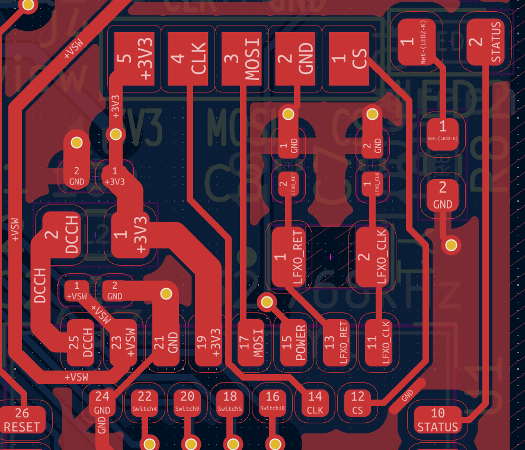
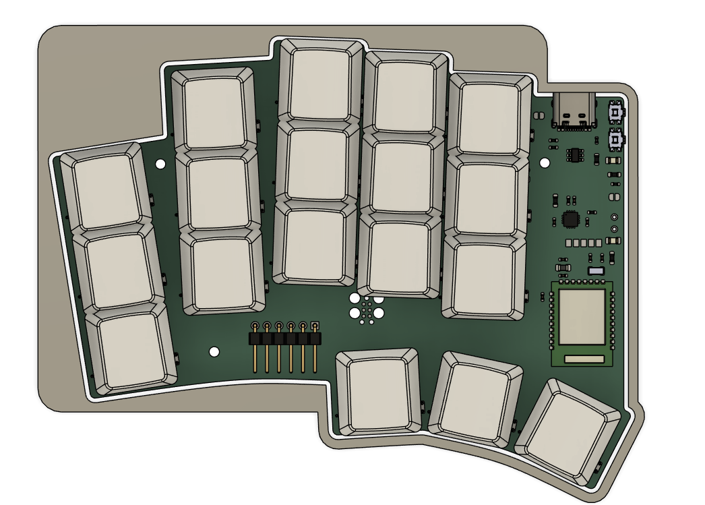

# June 26th

I started working on getting the project setup. I removed the old files, updated the Ergogen code, and recreated the KiCAD project

Also, I use Ergogen to just [place the switches](https://github.com/adamws/kicad-kbplacer) on the PCB using a KiCAD. No actual PCB is generated by it.

## Schematic work

I'm mostly taking ideas and design from the amazing [ZMK Design guide](https://github.com/ebastler/zmk-designguide) and the work I've done for quiz-sys. I plan to re-use most of the components I did for the [Woagboard v0.2](https://github.com/suyashsurya/woagboard/tree/v0.2), but with everything completely re-done.

Fun thing for the BQ24075 is that I can just... Completely ignore the SYSOFF pin. ZMK has a soft-off mode that allows me to turn off and on the keyboard
through a button, so I'll be adding that to my design.

I decided to move a bunch of components in-line rather than putting them on a separate bit of the schematic, such as the low-power oscillator and DCCH inductor.
The design on the design guide confused me for the first time, since it didn't make sense to me. This makes it way clearer to my silly brain.


_Huh. That's a lot clearer than the decoupling capacitors being like 50 spaces away._

Not sure how I feel about the DCCH loop, but it works for now.

Also for the first time ever: I filled out the info block

_WOAG_


_I'm pretty proud of this ngl_

I might add ARGB later, depending on if I'm feeling up for the absolute routing nightmare that it is going to be

**Total time spent: 3 hours**

Next up: PCB footprints and board outline

# June 27th

Started early today at ~11:10. Worked for... the entire day.

Did a check over my schematic and started working on footprints. I redid my old Panasonic EVQP7C01P footprint and made a new crystal oscillator footprint.


_Algebra go brr_

I took my Choc V1 Reversible PCB footprint from the Yeagboard. I am not remaking that. It genuinely took me 2 days to get that working when I did it.
I might modify it to add ARGB, but I'm unsure, especially considering battery life implications

Anyways: I started off with this mess for the PCB:

_Lettuce begin the train of pain_


_...And this is the only reason I used ergogen_

I initially planned to have the MCU antenna face the right side of the board, but then I realised that, for my insanely tight routing plans, I would not have enough space.
Thus, compromise: the MCU faces downwards. This is going to be fun to route later.


_Oh no..._

And then I kinda just... got into a flow. The world didn't exist. Just me, KiCAD, and a hell of a lot of routing to get done.
It is now... ~18:00 When I wrote this. It's been like 4 hours of continuous routing. I do not like routing because it feels
like you spent so much time but got nothing done. Bleh.

Anyways here's some fun things I've routed:

Tag Connect TC2030 "connector" (AKA just a bunch of pads and holes)

_Forgive me JLCPCB, for I have sinned_

The Nrf52840 DC/DC buck converter

_Honestly, this was pretty fun to try optimise_

Update: it's now 10PM. After quite a few delays and things inbetween, first routing pass is done! This part took me the longest:

_Just wrapping my head around what I was viewing was half the battle_

Anyways I'm tired and it's time to sleep

**Total hours spent: 7 hours** (yep...)

# June 30th

I realised I forgot to add a status LED. Oops.
...I also forgot to use wakatime-kicad. Oops x2 combo.

Turns out, JLCPCB only has 6 options for basic LEDs. Kinda limit colour selection :c.

I mostly worked on the board outline today. Turns out, KiCAD now has a decent bezier curve tool. It also has decent edge rounding.
I no longer need FreeCAD and 5000 constraints to make a decent board outline anymore, which is really nice.

I also decided to replace the USBLC6 with an SRV05-4. It's recommended by the zmk designguide and doesn't require an extra capacitor (which I forgot about for the USBLC6), which is nice.

I also finally added in more 3D models for the keyswitches and caps, and now plan to make a case for it in FreeCAD. Time to see how that goes.
Finally for today, a blender render of the board.


_[pcb2blender](https://github.com/30350n/pcb2blender) my beloved_

Next up: Make a case for the board in FreeCAD


**Total hours spent: 4 hours**

# July 2nd

I have decided I want a screen on the woagboard. PCB update time.

I've decided to go with a nice!view, mostly because it's a standard size (so I can attack a cheaper OLED if I wanted to), and should be *fairly* simple to add to the board.

Update: The screen won't fit. It intersects with the MCU traces badly :c


_Yeah that ain't working out, chief._

Idea 2: place pads and just wire up the screen


_Well... It worked, but it was painful_

I also decided to do a tiny bit of work on the silkscreen. Thus: info block


_BEEEEEEEEEEEEEEEEEEEEEEEE_

**Total hours spent: 2 hours**

# July 3rd-9th

So uh, I was on holiday for a week. In that time I worked on the hardware design a _lot._
I wasn't able to journal much (I was), so I hope a post-review is adequate.

Anyways: I did not use FreeCAD. That thing scares me still. Instead, I used Fusion 360. This also has the handy benefit of automatically keeping track of revisions, and boy do I have a lot of them. For the timing, I have timestamps in fusion to work off of. It won't be completely accurate, but it's something to consider

## July 3rd


_In the beninging_

I started off with making a sketch. And this is the main issue honestly: I only used 2 sketches for most of the design phase, constantly editing it. This lead to some... _interesting_ sketch intersections later on.


_Woah! Geometry!_

As you can see, I settled on a design pretty fast. Most of the design iterations was making this basic idea _look good_ and _be as thin as possible_

I continued designing, making cutouts for the switches, etc. I wanted the front to look like the TOTEM: where there aren't keys, it's filled in. It's a look and style I really like. So, I was being silly and thought "hmm. What if I just fill in the areas that aren't keys manually. Turns out, that would be slow and painful due to my weird curves and angles.


_Ok this ain't working chief_

Thus, a new idea that was suggested from a keyboard Discord server I'm in: simply extrude and cutout the bits where switches are. In practice, it meant I had to redo the sketch from scratch. So I did:


_8th times the charm!_

This... Actually looks pretty good I think. So I rolled with it.

**Total hours spent: 3 hours**

## July 4th

I then went ahead and started to add more cutouts for the top case, thumb cluster, etc. and continued adjusting the design. This is the point where my brain thought "if I just steal the TOTEMs design this will surely look good!" Turns out, that was false. I reverted the decisions soon after and tried going for a more rounded and flow-y design.



_Weird straight lines in a very curved design, but ok_

**Total hours spent: 1 hour**


## July 5th

So, heres the fun thing about the TOTEMs design (that I did keep until the end, but imo it just looks cool): The switch hotswap sockets are cutout from the bottom case. This means I need to add a sketch for every socket. The issue: the socket geometry is _weird._ This lead to uh, this:


_I heard you like tightly constrained sketch geometry_

This was hell to constrain. I used autoconstrain, but I had to clean it up so much that I'm not sure if it was worth it. There's also a small cutout for the debug header.


_Cutouts!_

I also made it so the cutouts were larger than the actual switches/holes as tolerance, which is why there's some intersection (it also makes it easier to 3d print to my knowledge).

I continues to clean up the top sketch, in preperation to continue working on it soon enough.

**Total hours spent: 4 hours**

## July 6th
I started finalising the top half of the case. The TOTEM goes for a design where the key plate is intergrated with the top half, giving a unique, nearly seemless look. I wanted to emulate that. After a lot of tweaking, I eventually landed on something like this:


_This actually looks pretty solid_


_"And is a snug fit"_

**Total hours spent: 2 hours**


## July 7th

I finalised the case, and started working on taking the timeline, and updating it to make 2 cases at once (for both the left and right side)

Heres some fails that happened while trying to refine this further:


_Well this is just weird_

Cutouts arent' cut out, the plate just vanished, and fusion was complaining about a combine for some reason in the timeline. No idea what I was doing. I fixed it at some point though, and heres the final revision of the left case, before I started working on the dual case:


_Woag! (case)_

Here's a quick render (I adjusted the physical materials so it looks ok):


_Fusion didn't compute the subsurface properly so that's why theres the weird red and blue_

Now: Dual case time.

The way I handled this was pretty interesting: I duplicated the fusion project, and just went through the timeline step-by-step, updating to mirror things as needed.

First: the sketches


_Also featuring a new PCB model!_

A not so fun part was, once again, the hotswap sockets, since they're only mirrored in pcb-space, but individually aren't. This lead to me having to adjust all of them by hand. Fun


_This was a pain to fix. Blegh_

Eventually, I finally got the sketches to a usable state. They went through about 20 more edits after this, but that was figuring out weird bugs and trying to improve tolerances.


_LGTM_

**Total hours spent: 4 hours** (There was a _lot_ of adjusting to the sketches to make them more usable to work with.)

## July 8th+9th

I got a lot of work done on the dual case, to the point of near completion. There's about 5 more revisions of just sketch adjustments, which doesn't look that great on it's own, so I'll skip a bunch to where I actually have something worth showing:


_Screws!! And updated rounded corners, margins, tolerances, bevels..._

Turns out: screw selection is hard. I spent about 1 hour alone going between screw datasheets, sizing, and websites to try find one that works and looks good. I eventually settled on M2x10mm and M2x12mm DIN 963 screws for the reference design, but in reality, any countersunk M2 screw will work. Fusions screw tool is really nice, as it can just create screws on-the-fly and fit em in properly. It's nifty.

Another thing that's difficult is to get rounded corners to look nice. I'm trying to strike a balance between flow and style (that doesn't make much sense, but it does to my brain). This was pretty difficult since I'm bad at design (and this is the 2nd case I've worked on ever).

Also, you'll notice a small issue with this design: the thumb cluster is unusable. The case intersects _with your thumb._ Oops. I noticed this by revision 12 and fixed it.


_Your thumbs can now hit the keys without having to phase through the board or move your entire hand. Incredible._

Anyways, back to actual updates: I wanted to add tenting feet to my design, since the boards aggressive splay with the ring and pinky fingers are only super comfy when it's tented. The first few iterations had... Issues. Mainly: the feet intersected with screws and the USB port... oops


_Ruh roh_

You also can see that the bottom case is uh... Thin. More specifically, .2mm. That ain't holding up. I fixed both of those in future revisions. Fast forward to the end of the day: we have something usable. Now it just needs polish.


**Total hours spent: 5 hours**

# July 13th

Back from holiday. Time to finish up this project. First up: the screen. I plan to use a nice!view, as mentioned earlier. Just need a way to mount it. I'm thinking maybe placing the screen in, and just covering with a sheet of plastic/acrylic that slides into the case. This should keep it removable as well.


_niceeeeeeeeeeeeeeeeeeeeeeeeeee_

Materials in fusion 360 are weird. It took me a solid like 10 minutes to get the nice!view thing looking like that lol.

I also hollowed out the top half of the right side. This allows me to fit a battery in there, rather than having to put it with the components.


_Hopefully this is enough space._

Also, as the last bit: holes for the buttons. I'm not going to be pressing them too often, so I won't add a bit that makes them easier to press for now. Probably will model something later


_Hole in two (I am running out of ideas for these)_

And with that, I think I'm done with the case! I'll probably be going through a lot more, but I think it's time to finalise my PCB BOM, do some final checks, and create a first draft of the firmware.

## RMK time

While going over the central.rs file for the firmware, I noticed there is an is_charging pin. I should probably use that. Lemme add it to the design lol


_Also took the time to cleanup nearby traces_

And... RMK with just raw rust is hard. There's a _lot_ it handles for you with the keyboard.toml file, but at the same time, I do like the absolute typesafety and errors rust gives me. Also autocompletion. Mainly autocompletion.

I have had to deal with ~20 errors and a bunch of refactorings due to the way I made my board, but I eventually got it to work. Keymap porting took a long time though. There's also some weird cumbersome issues when using rust directly, but it's manageable.

I also had the side-quest of a VIAL layout, which I could autogenerate using [ergogen](https://github.com/ergogen/ergogen) and [kbplacer](https://github.com/adamws/kicad-kbplacer). Main issue: YAML nonsense

```YAML
      rows:
        bottom:
          row_net: 2
          mirror.row_net: 2
        home:
          row_net: 1
          mirror.row_net: 1
        top:
          row_net: 0
          mirror.row_net: 0
```

The row nets for the top row aren't exported. Why? YAML seemingly takes that 0 as false, and just yeets the field entirely. Thus, I had to quote it
```YAML
      rows:
        bottom:
          row_net: 2
          mirror.row_net: 2
        home:
          row_net: 1
          mirror.row_net: 1
        top:
          row_net: "0"
          mirror.row_net: "0"
```

And now, we have VIAL :yay:.


_Configurable, even after flashed. Nice._

Anyways, I've spent most of the RMK work today going through the docs, figuring out everything at my disposal. I am missing a lot of stuff from ZMK:
- Tap Dance
- Auto Layers
- Per-key configuration for tap/layer holds

This probably makes this firmware less usable than my eventual ZMK option, but oh well /shrug. I have 1 layer down in code. Time for the rest of them tomorrow

**Total hours spent: 6 hours**

# July 14th

Finished RMK firmware dev, porting over from my zmk config. To make life easier for me in the future, I made a couple PRs to RMK! The main one is https://github.com/HaoboGu/rmk/pull/472, which makes some bits of the rust code (mostly Forks) a lot nicer to write.

Also: I went extra fancy on the formatting for fun
```rs
    #[rustfmt::skip]
    let base =
        [
        //  ╭─────────────┬─────────────┬─────────────┬─────────────┬─────────────╮ ╭─────────────┬─────────────┬─────────────┬─────────────┬─────────────╮
            [    k!(X),       k!(F),        k!(D),        k!(P),        k!(Q),           k!(J),      k!(Quote),      k!(O),        k!(U),       k!(Dot)   ],
        //  ├─────────────┼─────────────┼─────────────┼─────────────┼─────────────┤ ├─────────────┼─────────────┼─────────────┼─────────────┼─────────────┤
            [ mt!(N,ctrl), mt!(S,shift),  mt!(T,alt),   mt!(C,gui),     k!(Y),           k!(M),     mt!(H,gui),   mt!(A,alt),  mt!(E,shift),  mt!(I,ctrl) ],
        //  ├─────────────┼─────────────┼─────────────┼─────────────┼─────────────┤ ├─────────────┼─────────────┼─────────────┼─────────────┼─────────────┤
            [    k!(B),       k!(V),        k!(K),        k!(G),        k!(W),           k!(Z),        k!(L),    k!(RepeatKey),  k!(Slash),    k!(Comma)  ],
        //  ╰─────────────┴─────────────┼─────────────┼─────────────┼─────────────┤ ├─────────────┼─────────────┼─────────────├─────────────┴─────────────╯
            [a!(No),      a!(No),          k!(LGui),      k!(R),     lt!(fn,Return),    mo!(num),  lt!(nav,Space), k!(RShift),    a!(No),       a!(No)    ]
        //                              ╰─────────────┴─────────────┴─────────────╯ ╰─────────────┴─────────────┴─────────────╯
        ];
```

Can't really show images with code so none for today :pensive:

Tomorrow: Final work on the case and preparing to ship

**Total hours spent: 3 hours**
